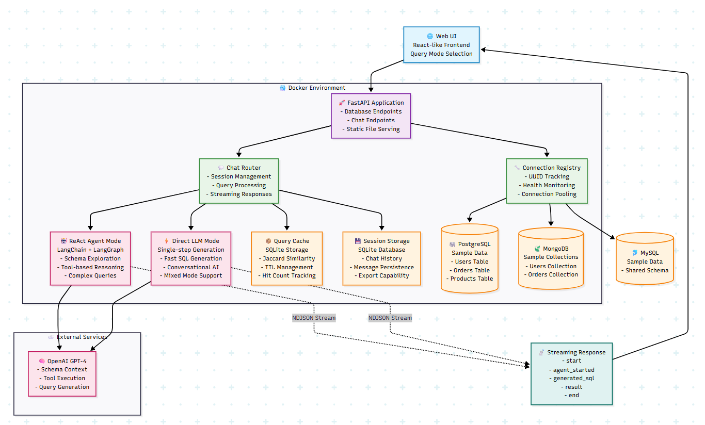
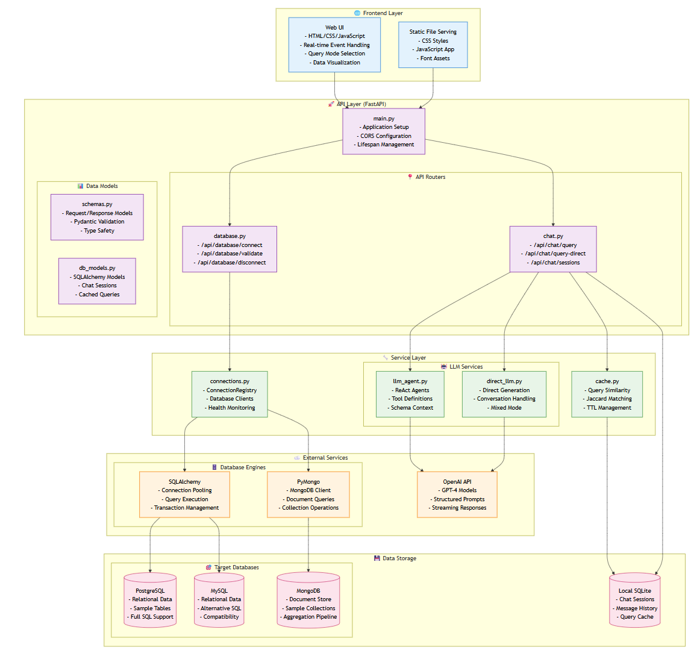

# Technical Approach and Design Decisions

## Architecture Overview

The system implements a FastAPI-based database chatbot with dual natural language processing approaches, supporting PostgreSQL, MySQL, and MongoDB databases through secure connection management and real-time streaming responses.

## Core Technical Approach

### 1. Dual LLM Strategy
**Decision**: Implemented two distinct approaches for natural language processing:
- **ReAct Agent Mode**: Uses LangChain/LangGraph with tool-based reasoning for complex queries
- **Direct LLM Mode**: Single-step SQL/MongoDB generation for faster responses and conversational AI

**Rationale**: ReAct agents excel at complex schema exploration but can be slow and hit recursion limits. Direct LLM provides speed and conversational capabilities while maintaining query accuracy.

### 2. Connection Management Architecture
**Decision**: Centralized connection registry (`ConnectionRegistry`) with in-memory storage and health monitoring.
- SQLAlchemy engines with connection pooling, pre-ping, and timeout management
- MongoDB clients with server selection timeouts
- UUID-based connection tracking with validation endpoints

**Rationale**: Ensures connection reliability, prevents stale connections, and provides proper resource cleanup while maintaining stateless API design.

### 3. Streaming Response Design
**Decision**: Server-sent events via newline-delimited JSON (NDJSON) streaming.
- Progressive event emission: `start` → `llm_processing` → `generated_sql` → `executing_sql` → `result` → `end`
- Real-time feedback during long-running operations

**Rationale**: Provides immediate user feedback, reduces perceived latency, and allows clients to display progress indicators during query processing.

### 4. Session and Cache Management
**Decision**: SQLite-based local persistence for chat sessions and intelligent query caching.
- Jaccard similarity matching for query cache hits
- TTL-based cache expiration with hit count tracking
- Session-based conversation history

**Rationale**: Improves performance through result reuse, maintains conversation context, and avoids external database dependencies for application state.

## Key Design Decisions

### Database Abstraction
**Choice**: Unified interface for multiple database types through connection registry pattern.
**Trade-off**: Some database-specific features are abstracted away for consistency, but enables seamless multi-database support.

### LLM Integration
**Choice**: OpenAI GPT models with structured prompting and schema injection.
**Trade-off**: Requires API key and external dependency, but provides superior natural language understanding compared to rule-based approaches.

### Error Handling Strategy
**Choice**: Graceful degradation with fallback mechanisms and detailed error context.
**Implementation**: Recursion limits, timeouts, and direct query fallbacks when agents fail.

### Deployment Architecture
**Choice**: Docker Compose with containerized databases and application.
**Rationale**: Ensures consistent deployment environment, simplifies demo setup, and provides production-ready containerization.

### Flow

## Security Considerations

- Parameterized queries to prevent SQL injection
- Connection validation before registration
- Environment-based configuration management
- No credential persistence in application state

## Performance Optimizations

- Connection pooling for database efficiency
- Query result caching with similarity matching
- Streaming responses for perceived performance
- Configurable recursion and timeout limits
